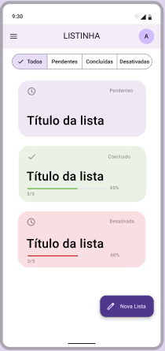

# Listinha

Aplicativo para criar várias listas para serem usadas simultaneamente e sincronizadas na nuvem após os dados serem salvos localmente (**Offline-first**).

# 1. Funcionalidades

1. Autenticação o mais simples possível.
2. Cadastrar várias listas diferentes.
3. Marcar e desmarcar itens reposicionando os desmarcados.
4. Sincronizar dados na nuvem.
5. Edição de usuário autenticado.
6. Configuração de dispositivo.

## 1.1 Autenticação o mais simples possível

A autenticação é necessária para efetuar a sincronização e deve ser opcional, ou seja, solicitada quando o usuário executar manualmente a sincronização.
A aplicação deve dar suporte a Autenticação “sem-senha” (**Passwordless**) enviando o token por email para fazer o acesso. 

## 1.2 Cadastrar várias listas diferentes.

O usuário poderá criar um número limitado de listas de compras, mostrando as informações totais da lista como: Nome da Lista, valor R$(se houver) e status em forma de card.

Os status da lista devem ser: Pendente, Concluída, Desativadas.

O usuário poderá filtrar as listas por status.

## 1.3 Marcar e desmarcar itens reposicionando os desmarcados.

Cada lista precisará dividir os itens marcado dos desmarcados e dando a opção ao usuário reposicionar os itens desmarcados.

## 1.4 Sincronizar dados na nuvem.

Todas as listas e seus dados serão guardados localmente no dispositivo do usuário, sendo sincronizados posteriormente na nuvem. A sincronização deve ser automática e as tentativas de sincronização em caso de falha devem ser feito em um espaçamento de minutos. Esse último ponto é importante para economizar bateria em dispositivos móveis.

## 1.5 Edição de usuário autenticado.

Caso autenticado, o usuário deveria ter a possibilidade de alterar informações como Nome, Sobrenome e imagem de perfil.

## 1.6 Configuração de dispositivo.

O app deverá ter opções de controle de tema e remoção de cache.

# 2. Experiência do Usuário

Toda interface será feita usando componentes pré-construidos do Material Design 3.
Informações de mockup, fonte e assets estão disponíveis no Figma.

[Link do Figma](https://www.figma.com/file/xSoyauWGMb25dsQCBrhPa5/Listinha?node-id=53095%3A27267&t=9eobg3NOs476wXmo-1)

# 3. Arquitetura

[Geral](ARCHITECTURE.md)

# 4. Vídeos

[#1. Iniciando os projetos](https://youtu.be/Y9QwJewv50w)